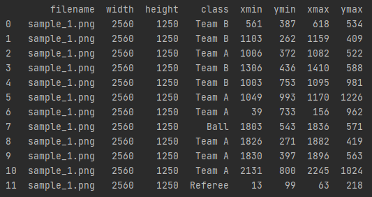

# Introduction

Over the last two decades the use of analytics has become pervasive in professional sports leagues. One component of interest is player location tracking with respect to the dimensions of the playing surface. The primary means of collecting this information is done through GPS tracking through wearable technology or manual annotations. Our project seeks to accomplish this through computer vision techniques.

Focusing on the sport of football (soccer), we will utilize available broadcast feeds to convert the video frames into a two-dimensional, overhead representation of the displayed player locations based on the corresponding portion of the pitch in the frame of the image. This will be accomplished by extracting the lines from the pitch and the point/s at which a player is making contact with the pitch, and applying the appropriate projection to transform the found coordinates into their two-dimensional overhead representation. Success of this process for a variety of still images for multiple pitches will establish the foundation for us to convert an entire broadcast feed into this overhead viewpoint. 

# Background and Related Work

# Progress So Far

## Pitch Line Detection

### Pixel Isolation 

The first step in line detection for our problem is to remove unnecessary pixels that could result in the identification of unimportant lines. To accomplish this we looked at two different techniques.

#### Red, Green, Blue Filtering (RGB)

Our first attempt at this isolation was using the RGB pixel values included within the image. The thought process was that because the pitch lines are always white, we would be able to isolate the white pixels. There were two issues with this approach. The first issue is fairly obvious, there are a multitude of unimportant white pixels throughout the image, including those in billboards and stadium features that obscure our goal. The second issues arises with the camera quality and image compression. Because the lines are constantly bordering the green grass of the field, the pitch line pixels often had elevated green values. If the RGB filtering was too focused on removing the green grass we would lose large pitch line sections, if the filtering was too relaxed in the green channel, large portions of the grass would remain included.

#### Hue, Saturation, Lightness Filtering (HSL)

Looking at solutions for road line detection we noticed their implementation of HSL filtering. HSL is a conversion to a new pixel definition space from the standard RGB space. Using the cv2 package, this conversion results in 3 values per pixel, ranging from 0 to 255. The 3 channels are true to their name with hue representing the color of the pixel, saturation representing the boldness of the pixel, and lightness representing the brightness of the pixel. For hue, we've found the best filter to be 0-80, isolating the green spectrem. Saturation is filtered to 150-255, and lightness is filtered to 20-255. 

### Line Detection

After isolating the pitch line pixels with the best results so far we implemented Canny edge detection through the cv2 package.

### Results

| Original | HSL Filter | HSL Canny | 
| :-----------------------------------------------------------------------------------: | :---------------------------------------------------------------------------------------------------: |  :---------------------------------------------------------------------------------------------------: | 
|  |  |  |
|  |  |  |
|  |  |  |
|  |  |  |

## Object Detection

The objects planned for detection are team A players, team B players, referees, goalies and the soccer ball. 
Detecting the goals is not necessary and adds a layer of complexity, so we removed it from object detection. Since we are looking to detect objects from live video camera angles, much from the images in the training dataset are taken from recorded soccer games.
Originally, the images were labelled by using different color bounding boxes per object category illustrated in the table below, but we ran into some difficulties when trying code the extraction of boundary points and category label.

| Image | Object Detection | 
| :-----------------------------------------------------------------------------------: | :---------------------------------------------------------------------------------------------------: | 
|  |  |
|  |  |

The images were re-labelled using "LabelImg" that provides boundary coordinates and labels for manually drawn boundary boxes. See the table below for an example.

| Image | Label Dateframe | 
| :-----------------------------------------------------------------------------------: | :---------------------------------------------------------------------------------------------------: | 
|  |  |

The next step, object recognition, is to develop a model with this training dataset and apply it to some test images or video streams.
The final step will be refinement of the model that may include increasing the training dataset images and improving the code.

## Pitch Line Projection

(Abstracting assignment 2 code)

# Revised Research Plan

- 4/10/2022:
- 4/17/2022:
- 4/24/2022:
- 5/01/2022:

# References

- Hough Transform: Underestimated Tool in the Computer Vision Field
    https://www.researchgate.net/profile/Simon-Karpenko/publication/228573007_Hough_Transform_Underestimated_Tool_In_The_Computer_Vision_Field/links/0fcfd51487c0d13691000000/Hough-Transform-Underestimated-Tool-In-The-Computer-Vision-Field.pdf

- A Computer Vision based Lane Detection Approach
    https://www.kuet.ac.bd/webportal/ppmv2/uploads/15695142241555251476A%20Computer%20Vision%20based%20Lane%20Detection%20Approach.pdf

- Tracking soccer players aiming their kinematical motion analysis
    http://citeseerx.ist.psu.edu/viewdoc/download?doi=10.1.1.86.6699&rep=rep1&type=pdf

- Semantic annotation of soccer videos: automatic highlights identification
    https://doi.org/10.1016/j.cviu.2003.06.004

- Soccer video and player position dataset
    https://doi.org/10.1145/2557642.2563677
  
- LabelImg Documentation: https://github.com/tzutalin/labelImg