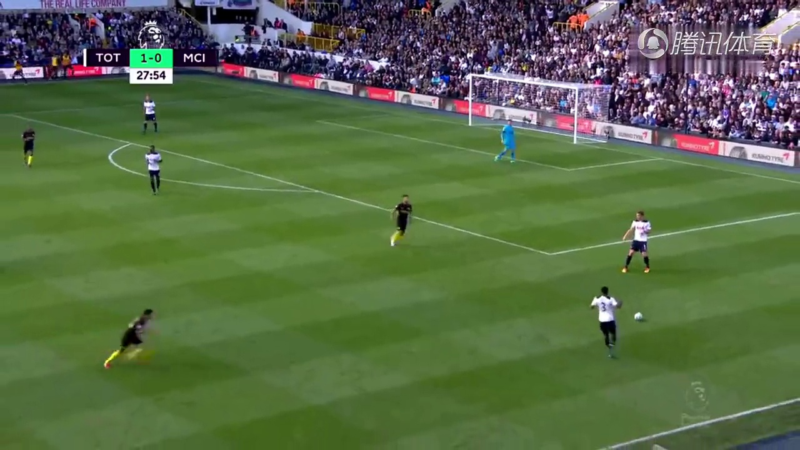
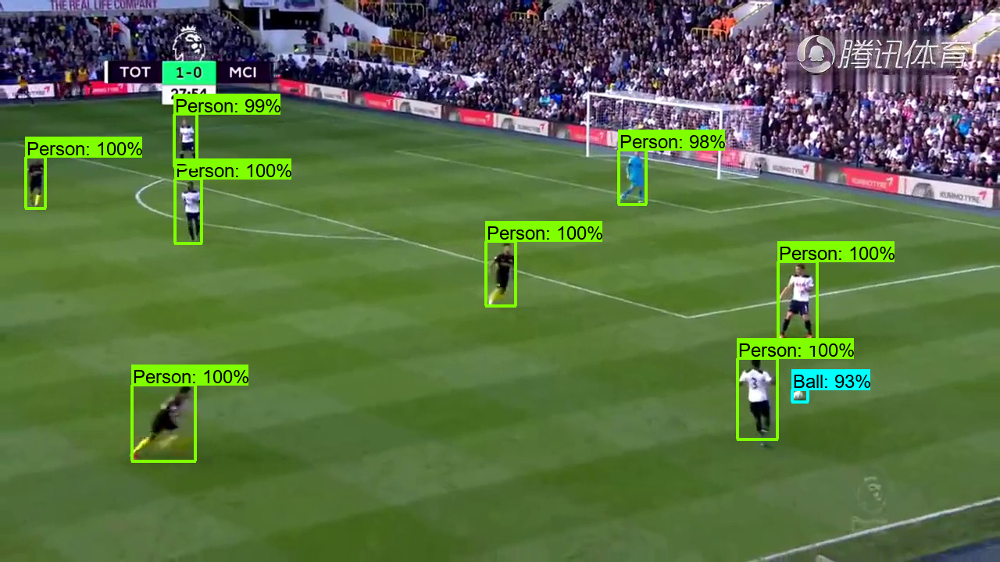

# Football Mapper
Project to create 2-d minimap representation of football (soccer) games.

Seth Mize, Lucas Franz, Bryant Cornwell

# Introduction

Over the last two decades the use of analytics has become pervasive in professional sports leagues. One component of interest is player location tracking with respect to the dimensions of the playing surface. The primary means of collecting this information is done through GPS tracking through wearable technology or manual annotations. Our project seeks to accomplish this through computer vision techniques.

Focusing on the sport of football (soccer), we will utilize available broadcast feeds to convert the video frames into a two-dimensional, overhead representation of the displayed player locations based on the corresponding portion of the pitch in the frame of the image. This will be accomplished by extracting the lines from the pitch and the point/s at which a player is making contact with the pitch, and applying the appropriate projection to transform the found coordinates into their two-dimensional overhead representation. Success of this process for a variety of still images for multiple pitches will establish the foundation for us to convert an entire broadcast feed into this overhead viewpoint.

# Background and Related Work

Our project is focused on coupling multiple existing techniques towards a new application. The problem can be broken into 3 primary categories; Line Detection, Object Detection, and Projection. By identifying the standard lines of the pitch, we can compare them with a proportion overhead representation of standard pitch line to solve for a projection transformation. Once a transformation matrix is solved for, identified objects can be mapped into the same overhead space. Further object categorization can be used to provide more detail to the generated overhead representation.

When investigating the best applications of line detection we found the most useful prior research to be lane detection for autonomous vehicles. The Tracking soccer players aiming their kinematical motion analysis article discussed how to split blobs or groups of more that one player with detection which we will need to utilize when recognizing a detected groups of players. For the image projection from the video projection to the overhead projection, the course material related to assignment 2 has been our reference.

# Methods
## Overhead view base photo
Source: https://conceptdraw.com/a1992c3/preview

## Object Detection

The first task was to create a dataset by taking some images from a few football games and manually label them to train a model for object detection. The 12 images for this dataset were from four different FIFA World Cup football games hosted on the FIFA youtube channel. 
Images were labelled using "LabelImg" [[1]](https://github.com/tzutalin/labelImg). This is a tool used to manually apply bounding boxes to an input image, label them, and export a xml file that consists of box locations and associated labels for the given image. The dataset used can be found [here](documentation/data/original) and the associated xml files are [here](documentation/data/detection_images).
The players were labelled as "Person" and the football as "Ball" for each of the images. TensorFlow 2 object detection API tutorial was utilized throughout the object detection model development [[2]](https://tensorflow-object-detection-api-tutorial.readthedocs.io/en/latest/training.html).

The TensorFlow Models repository was cloned and extracted [here](Bryant/TensorFlow) and a workspace directory was generated for this project's object detection model development.

A .txt file was create with the following contents and converted to the .pbtxt file extension([labels_objects.pbtxt](Bryant/TensorFlow/workspace/training_model/annotations/labels_objects.pbtxt)):

    item {
    name: "Person"
    id: 1
    }
    item {
    name: "Ball"
    id: 2
    }
This file is used to map the labels to an integer value as an ID for training the model and detecting objects using the model. 

To train and test the model, the dataset (.xml and .png files) was separated into an 83/17 split train/test sets and stored in different folders ([train](Bryant/TensorFlow/workspace/training_model/images/train) and [test](Bryant/TensorFlow/workspace/training_model/images/test)).
To generate the model, the test and train sets must be converted into .record files. The [generate_tfrecord.py](Bryant/TensorFlow/scripts/preprocessing/generate_tfrecord.py) was provided within the extracted TensorFlow Models repository to convert the xml files for the train and test sets to train.record and test.record files. The following terminal commands are how the record files were produced for this project from the root football-mapper path:

    cd Bryant\TensorFlow
    #  Create the train record file in the annotations folder.
    python scripts\preprocessing\generate_tfrecord.py -x workspace\training_model\images\train -l workspace\training_model\annotations\labels_objects.pbtxt -o workspace\training_model\annotations\train.record
    #  Create the test record file in the annotations folder.
    python scripts\preprocessing\generate_tfrecord.py -x workspace\training_model\images\test -l workspace\training_model\annotations\labels_objects.pbtxt -o workspace\training_model\annotations\test.record

To generate the model with TensorFlow 2 API, a pre-trained model was required. Since a person is a class within the COCO dataset [[3]](http://cocodataset.org) models for this dataset were priority. The TensorFlow Models repository provides links to multiple pre-trained models for the COCO dataset [[4]](https://github.com/tensorflow/models/blob/master/research/object_detection/g3doc/tf2_detection_zoo.md).
The model used for this project was the Faster R-CNN ResNet50 V1 1024x1024 (faster_rcnn_resnet50_v1_1024x1024_coco17_tpu-8.tar), since faster-rcnn models tend to be more accurate [[5]](https://github.com/tensorflow/models/blob/master/research/object_detection/g3doc/configuring_jobs.md). 

The extracted .tar file consists of a pipeline.config, checkpoint (.cpkt) files, and the saved_model.pb. The pipeline.config was copied [here](Bryant/TensorFlow/workspace/training_model/models) and the checkpoint files here copied [here](Bryant/TensorFlow/workspace/training_model/models/checkpoints). The paths for the train/test datasets and checkpoint files were added to the pipeline.config to prepare for training a new model.
The train_config section was modified to reduce the memory allocated for training the model and checkpoint type from 'classification' to 'detection'.
See the [pipeline.config](Bryant/TensorFlow/workspace/training_model/models/pipeline.config) for the final configuration used for training the object detection model.

With the files setup, the [model_main_tf2.py](Bryant/TensorFlow/workspace/model_main_tf2.py) program provided by the TensorFlow Models cloned repository was used to train a new checkpoint with the 12 image dataset. To train the new model, the following terminal commands were used:
    
    cd  Bryant/TensorFlow/workspace
    #  Model_dir is where the output of the training checkpoint will be created and stored.
    python model_main_tf2.py --model_dir=training_model/models/pre-trained-models --pipeline_config_path=training_model/models/pipeline.config

After the checkpoint files for the model are generate, the [exporter_main_tf2.py](Bryant/TensorFlow/workspace/exporter_main_v2.py) provided by the TensorFlow repository was used to export the new trained checkpoint files to a .pb model file. The following terminal command was used:

    python exporter_main_v2.py --input_type image_tensor --pipeline_config_path training_model/models/pipeline.config --trained_checkpoint_dir training_model/pre-trained-models --output_directory training_model/exported-models

The code for applying the object detection model to an image can be found with the [detection.py](Bryant/detection.py) program, and the result can be found in the results section of this report.

# Results
## Object Detection
The following images were taken from the TV_Soccer dataset provided by the soccer player detection and tracking research paper by Samuel Hurault, Coloma Ballester, Gloria Haro ([google drive link](https://drive.google.com/drive/folders/1dE1yzHyBOVGs4A1VlmFTq_TXOT1S5f_b?usp=sharing)).

| Original Image | Detected Image | 
| ----------------------------------------------------------------------------------- |--------------------------------------------------------------------------------------------------- | 
|  |  |

# Discussion
## Object Detection
### Image labeling and dataset for custom object detection model

The first task was to take some images from a few football games and manually label them to train a model for object detection.
The objects planned for detection are team A players, team B players, referees, goalies and the soccer ball. Since we are looking to detect objects from live video camera angles, much from the images in the training dataset are taken from recorded soccer games. Originally, the images were labelled by using different color bounding boxes per object category illustrated in the table below, but we ran into some difficulties when trying code, the extraction of boundary points and category label.   

| Image | Object Detection | 
| ----------------------------------------------------------------------------------- | --------------------------------------------------------------------------------------------------- | 
|  |  |
|  |  |

The images were re-labelled using "LabelImg" that provides boundary coordinates and labels for manually drawn boundary boxes. When an image has been labelled manually, the output from LabelImg is an xml file that provides the image name, image size, bounding box coordinates, and class. See the table below for an example of a manually labelled image with a corresponding dataframe of information.

| Image | Label Dateframe | 
| ----------------------------------------------------------------------------------- |--------------------------------------------------------------------------------------------------- | 
|  |  |

During the model development, a group decision was made to simplify the model to find two classes, person and ball.  

### Custom model development
#### First Approach
The next step for object detection, was to develop a model with this training dataset and apply it to some test images.

This being a first time working on object detection, I watched a video by Murtaza's Workshop on how to implement object detection ([link](https://www.youtube.com/watch?v=HXDD7-EnGBY)). This video provided insight on how to use a pre-trained model and apply it to still images and video feed.

After searching through some tutorials, I stumbled upon the TensorFlow 2 Object Detection API tutorial ([link](https://tensorflow-object-detection-api-tutorial.readthedocs.io/en/latest/training.html)) for training a custom object detector. The official tensorflow github models repository ([link](https://github.com/tensorflow/models)) was downloaded to prepare for building the detection model. 

After generating the .pbtxt and .record files, the tutorial [2] did no go into details of generating a new custom model, but rather uses an existing pre-trained model to train a new model. Since the goal was to create a new custom model, I followed the provided [link](https://github.com/tensorflow/models/blob/master/research/object_detection/g3doc/configuring_jobs.md) to developing a config file for developing a model. This link detailed the differences between a faster-rcnn and ssd models, which the faster-rcnn model was chosen for this project due to its trend towards high accuracy in combination with the small dataset used to train the model.
Templates for config files can be found [here](Bryant/TensorFlow/models/research/object_detection/configs/tf2) and the one used for this initial attempt was the faster_rcnn_resnet50_coco.config file. In an attempt to train the model using [model_main_tf2.py](Bryant/TensorFlow/workspace/model_main_tf2.py) provided in the tensorflow git repo, running the following terminal commands and troubleshooting errors lead only to a dead-end due to the config file requiring a pre-trained model checkpoint file to generating a new model. 

    cd Bryant\TensorFlow\workspace

    python model_main_tf2.py --model_dir=models --pipeline_config_path=models/faster_rcnn_resnet50_coco.config

Checkpoint files were found for this model, but the version of the files were not supported for version 2 of the TensorFlow API. There was dated/lack of information for troubleshooting this final error, so the group decided to try another approach.

NOTE: The third approach of this model development section utilizes most of the assets of this first approach.
#### Second Approach
The source used for this approach comes from a soccer player detection and tracking research paper by Samuel Hurault, Coloma Ballester, Gloria Haro [[6]](https://arxiv.org/abs/2011.10336). This research paper provided their github [[7]](https://github.com/samuro95/Self-Supervised-Small-Soccer-Player-Detection-Tracking) and code for the research. The goal of this approach was to use one of the models from this project as a pre-trained model for the object detection model development.
The models were generated in pytorch with an .pth file extension. The "Fine-tuned Resnet50 teacher model" was downloaded and the README.md for the github was followed to test the training. Unfortunately, the goal of the source project was to retrieve an accuracy against a ground truth (Oracle model), so there was no documentation detailing the use of the model as a pre-trained model. After attempts to use it as a pre-trained model and further research, the .pth (PyTorch) model could not be loaded/utilized by familiar tools and libraries.

The source provided links to multiple soccer image datasets, which were used in testing and different sections of this project ([google drive link](https://drive.google.com/drive/folders/1dE1yzHyBOVGs4A1VlmFTq_TXOT1S5f_b?usp=sharing)).
#### Third Approach
This approach revisits the original attempt, but utilizing a pre-trained model provided by TensorFlow 2 Object Detection API tutorial and github [[4]](https://github.com/tensorflow/models/blob/master/research/object_detection/g3doc/tf2_detection_zoo.md).
The model downloaded was the Faster R-CNN ResNet50 V1 1024x1024 (faster_rcnn_resnet50_v1_1024x1024_coco17_tpu-8.tar) that was trained for the COCO 2017 dataset [[3]](http://cocodataset.org/). As determined in the first approach, the faster-rcnn model type was chosen. The COCO dataset consists of people and other objects which would beneficial for detecting at least soccer players. 
The extracted .tar file consists of a pipeline.config, checkpoint (.cpkt) files, and the saved_model.pb. The pipeline.config was copied [here](Bryant/TensorFlow/workspace/training_model/models) and the checkpoint files here copied [here](Bryant/TensorFlow/workspace/training_model/models/checkpoints). The paths for the train/test datasets and checkpoint files were added to the pipeline.config to prepare for training a new model.

There were many out of memory errors that fixed by lowering the batch_size and number of steps within the pipeline.config file. Additional software was installed to allow and implement GPU computation for training the model. The changes to the pipeline.config are detailed below as in-line comments:

    batch_size: 2  # Changed from 64.
    sync_replicas: true
    startup_delay_steps: 0
    replicas_to_aggregate: 8
    num_steps: 5000  # Changed from 10000.
    optimizer {
        momentum_optimizer: {
          learning_rate: {
            cosine_decay_learning_rate {
            learning_rate_base: .04
            total_steps: 5000  # Changed from 10000.
            warmup_learning_rate: .013333
            warmup_steps: 1000  # Changed from 2000.

Since there was a file called "checkpoint" that would be created, the checkpoint folder had to be renamed to checkpoints. The checkpoint files were eventually moved to the pre-trained-models folder negating this issue. The final error was solved by changing the checkpoint type to 'Detection' from 'Classification' within the  train_config portion of pipeline.config.

After the checkpoint files for the model were generated, the exporter_main_tf2.py provided by the tensorflow github was used to export the new trained checkpoint files to a .pb model file.

### Use of the custom object detection model

When looking through documentation to load a model, I stumbled upon a few outdated methods for the first version of the TensorFlow API that halted progress for a while. One of these methods being the video linked in the first approach.
These methods consisted of transferring the model to a frozen inference graph and loading the model with cv2.dnn.readNetFromTensorflow(pb_file, pbtxt_file) and cv2.dnn_DetectionModel(pb_file, pbtxt_file) from the opencv library. The persistent error was getting the memory shapes of the data layer.

After a closer look at the TensorFlow 2 (TF2) Object Detection API tutorial, the "Examples" section provided starter code for loading a TF2 model and running it on an image. The code for this can be found in [detection.py](Bryant/detection.py). See the results section for images tested using this model.

# Conclusion

# References
[1] LabelImg Github: https://github.com/tzutalin/labelImg

[2] TF2 Object Detection API Tutorial: https://tensorflow-object-detection-api-tutorial.readthedocs.io/en/latest/training.html

[3] COCO Dataset website: http://cocodataset.org/

[4] TF2 Pre-trained (COCO Dataset) Detection Models: https://github.com/tensorflow/models/blob/master/research/object_detection/g3doc/tf2_detection_zoo.md

[5] Configuring TF2 Object Detection Pipeline: https://github.com/tensorflow/models/blob/master/research/object_detection/g3doc/configuring_jobs.md

[6] Football Player Detection and Tracking Paper: https://github.com/samuro95/Self-Supervised-Small-Soccer-Player-Detection-Tracking

[7] Football Player Detection and Tracking Github: https://github.com/samuro95/Self-Supervised-Small-Soccer-Player-Detection-Tracking